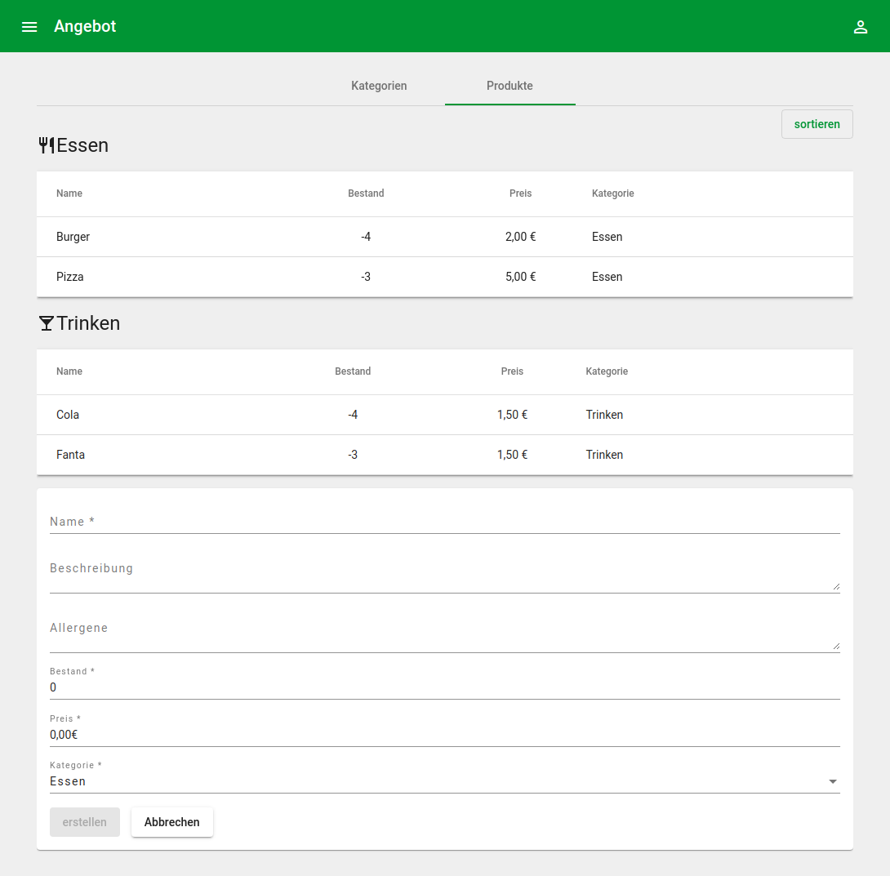

# Projekt

Ich bin einer der Organisatoren des [Heimatzoo Festivals](https://www.heimatzoo.de/). Während der Covid19 Pandemie konnten wir leider das Festival nicht wie gewohnt durchführen. Stattdessen gab es 10 Veranstaltungen mit je 30 Tische mit jeweils 10 Sitzplätzen die vor einer kleineren Bühne aufgebaut wurden. Um lange Schlangen und Menschenmengen zu vermeiden, habe ich ein Bestellsystem entwickelt, über das man direkt am Tisch über das Handy bestellen kann.

Der Besucher scannt einen für den Tisch generierten QR-Code, es öffnet sich automatisch die Speisekarte. Hier kann der Besucher einfach via +/- eine Bestellung erstellen und abschicken.

Alle Bestellungen werden automatisch bei den verschiedenen Ständen (Essen, Getänke) angezeigt und können abgearbeitet werden. Eine Bestellung hat verschiedene Status: in preparation, ready, finished, Canceled und Archived.

Je nach Konfiguration wissen Besucher nun wann sie ihre Bestellung abholen müssen, bzw. wann sie ihre Bestellung erhalten. 

## Features
- komplett Responsive, optimiert für Smart Phones und Tablets
- Sammelbestellung oder Bestellung nach Kategorie
- Integrierter QR-Scanner und Generator
- Druckfunktion für Tisch-Codes
- Allergen können hinterlegt und in der Karte angezeigt werden
- Zoom im Admin-Bereich
- Verschiedene Rollen
  - Admins: Pflege der Karte, Bestand, Benutzer, Einstellungen
  - Runner: Bearbeiten von Bestellungen
- Live Aktualisierung über Websockets
- Sortierung der Karte und der Kategorien via Drag'n'Drop
- Automatisches deaktivieren von Produkten wenn der Bestand 0 erreicht
- Individuelle Codes für jede Bestellung (Mit kodierten Tisch)
- Bei neuen Bestellungen wird ein Ton abgespielt
- Das System kann via einem Logo-Upload personalisiert werden


## Screenshots

### Admin Übersicht





### Besucher Übersicht


## Development

start db
```bash
npm run db:start
```

start develop watch task for api
```bash
npx nx serve food-order-api
```

start develop watch task for angular application
```bash
npx nx serve food-order
```
